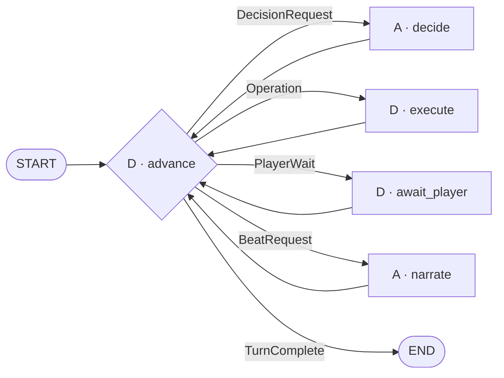

# Game flow v2: execution structure

This document is the implementation guide for the LangGraph structure behind
the game flow. The gameplay contract it implements — moves, narration timing,
combat order, ownership of rolls and transcript invariants — is stated in
[the game module README](../../backend/app/modules/game/README.md) and in
[game-flow.v2.examples.md](game-flow.v2.examples.md); the earlier node-by-node
graph document was retired with the old flow.

The graph has five reusable nodes. D&D concepts such as attacks, checks,
movement and initiative are typed data handled by those nodes, rather than
separate graph nodes.

## Design goals

1. The graph, never the model, orders mechanics.
2. Each graph visit performs at most one model decision, one player pause or
   one deterministic operation with side effects. A decision may consult
   read-only tools within a fixed budget before it is returned.
3. Database state is authoritative for lasting world facts and history. Graph
   state is authoritative for the active turn or combat sequence.
4. A player pause or ordinary process restart resumes the same checkpointed
   request, action and combat cursor.
5. New move and mechanic types should normally add typed contracts and
   handlers, not graph nodes or edges.

## The graph



Only `advance` routes. The other four nodes always return to `advance`. Use one
`add_conditional_edges` call from `advance`, with an explicit destination map,
and ordinary edges from the worker nodes back to it.

`END` means that this graph invocation is finished. It does not by itself mean
that the adventure ended. The persisted lifecycle says whether the table opens
the composer, displays a player request, reports an execution error or shows
the adventure ending.

## The five node contracts

### `advance` — deterministic scheduler

`advance` is the control plane. On every visit it:

1. Reloads the authoritative run, hero, scene, occupants, authored content and
   relevant ledger records.
2. Reconciles the graph cursor with committed database state.
3. Checks the mandatory obligations in the priority order below.
4. Produces exactly one `NextEffect`.

It does not call a model, sample dice, interrupt or mutate world state. Its
logic should be split into ordinary pure functions such as `advance_action`,
`advance_combat`, `advance_reactions` and `validate_turn_close`. These are code
abstractions, not graph nodes.

### `decide` — structured model decision

`decide` receives a `DecisionRequest`. A registry selects the prompt and
structured output contract for its `kind`. It makes one model call and returns
a validated `DecisionResult`.

It covers the model decisions required by the flow:

- classify the first player move;
- interpret retrieved rules or recalled history;
- judge an ambiguous reference;
- assess an authored discovery, fixture action, exit condition or consequence;
- choose a monster action;
- choose world reactions.

Combining these behind one graph node does not combine them into one prompt or
one broad output contract. Each decision kind keeps a narrow type and receives
only the evidence it needs. Model output may nominate candidates and propose
actions; it never writes object state, selects a graph destination or supplies
an operation ID.

#### Read-only tools inside `decide`

Two knowledge reads are bound to the decision model as ordinary tools:
`lookup_rule` (SRD retrieval) and `recall_history` (anchored transcript
recall). They are the only tools any model in the graph can call, and they
are the one exception to "one model call per visit": a strategy that binds
them runs a small tool loop inside the node function, at most three tool calls
per decision, then returns its structured `DecisionResult`. The loop is code
inside `decide`, not a graph node or edge, so the topology and the router are
unchanged.

The exception is safe because both tools are pure reads with no side effects,
no dice and no player request. Every mutating or randomising mechanic remains
an `Operation` chosen by deterministic code. `narrate` never receives these or
any other tools. Which strategies bind them is part of each strategy's
definition; reading a player move and interpreting evidence are the expected
ones.

### `execute` — one deterministic operation

`execute` receives one `Operation` and dispatches it through an operation
registry. A handler calls a public domain service, normally
`playthrough.service`, and returns a structured `OperationResult`.

One visit executes one operation. For example, an attack roll, resolving the
attack and applying damage are three separate visits. This leaves a checkpoint
between effects and keeps an unresolved hit visible as an obligation.

Operations include bookkeeping as well as game mechanics:

- reference binding and action reservation;
- roll or question request creation;
- player and monster rolls;
- check, save, fixture, item, exit, attack and damage mechanics;
- initiative settlement and action completion;
- departure, hostility and hold mechanics once their service contracts exist;
- narration recording, turn closure and run completion.

Handlers remain small functions. `execute` is a dispatcher, not a second
domain service and not a transaction owner. The called service owns its
transaction.

### `await_player` — isolated pause

`await_player` handles a request already stored in graph state. It calls
`interrupt()` with the public request projection and, on resume, returns the
submitted request ID and response as a `ResumeResult`.

There must be no database write, model call or random operation before the
interrupt. LangGraph restarts the interrupted node on resume. Reading the
already checkpointed payload is safe; creating the request or rolling before
the interrupt is not.

After resumption, `advance` validates that the response matches the checkpointed
request and refreshes the durable world state. A valid Roll acknowledgement
produces a player-roll operation. A valid answer produces an answer-acceptance
operation. A stale response is rejected rather than applied to another request.

### `narrate` — evidence-constrained prose

`narrate` receives one `BeatRequest`, calls an unbound model and returns a
`BeatDraft`. It has no tools.

The request contains an allowlist of facts and event IDs that may support the
beat. An attempt beat has intent but no outcome evidence. A wound or death can
enter a beat only after damage committed. The draft is not itself a transcript
event: on the next visit, `advance` emits a `record_beat` operation for
`execute`.

Keeping generation and persistence separate means a database failure does not
lose the draft, and retrying persistence does not pay for or vary another model
completion.

## Effects

`advance` always writes one discriminated effect. The router examines only its
top-level type.

```python
NextEffect = (
    DecisionRequest
    | Operation
    | PlayerWait
    | BeatRequest
    | TurnComplete
)
```

Suggested minimum contracts:

```python
class DecisionRequest:
    decision_id: str
    kind: DecisionKind
    evidence_ids: list[str]
    payload: dict[str, JsonValue]


class Operation:
    operation_id: str
    kind: OperationKind
    payload: dict[str, JsonValue]


class PlayerWait:
    request_id: str
    kind: Literal["roll", "choice"]
    public_payload: dict[str, JsonValue]


class BeatRequest:
    beat_id: str
    kind: BeatKind
    allowed_evidence_ids: list[str]
    payload: dict[str, JsonValue]


class TurnComplete:
    status: Literal["open", "terminal", "execution_error"]
```

Use `TypedDict`, dataclasses, enums, literals and unions for graph state,
effects, cursors and internal operation results. Use Pydantic only at a boundary
that requires its validation or serialization, such as existing API and content
schemas or a structured-output adapter that cannot consume the simpler type.
Do not introduce Pydantic models merely to represent internal graph data.
Avoid using node names, callable names or arbitrary continuations in effect
payloads. The router owns the mapping from effect type to graph node, while the
registries own the mapping from enum values to handlers.

Every result identifies the request it answers:

```python
class DecisionResult:
    decision_id: str
    kind: DecisionKind
    value: ValidatedDecision


class OperationResult:
    operation_id: str
    status: Literal["ok", "refused", "error"]
    event_ids: list[str]
    value: dict[str, JsonValue]


class ResumeResult:
    request_id: str
    value: JsonValue


class BeatDraft:
    beat_id: str
    text: str
    usage: Usage
```

`advance` accepts a result only when its ID and kind match the outstanding
checkpointed effect. IDs correlate transient work; they are not database
idempotency keys.

## Execution state

Keep graph state small and serializable. The database owns lasting world facts
and transcript events. Graph state owns active requests, rolls, operation
results and execution cursors until the turn or combat sequence finishes.

```python
class GameFlowState(TypedDict):
    turn: TurnFrame
    move: Move | None
    action: ActionCursor | None
    combat: CombatCursor | None
    awaiting: AwaitingRef | None
    pending_hit_id: str | None
    reactions: list[ReactionSpec]
    narrative: NarrativeCursor
    effect: NextEffect | None
    result: EffectResult | None
    error: ExecutionError | None
```

### `TurnFrame`

Contains `run_id`, `hero_id`, `turn_id`, input kind and text, lifecycle status,
and whether a round has been admitted. A new player message creates it. A Roll,
answer or retry resumes it unchanged.

### `SituationProjection`

Contains the refreshed model-safe view of the current adventure, scene, hero,
inventory, occupants, hidden content, fixtures, exits, consequences and recent
evidence. Build it when `advance`, `decide` or `narrate` needs it; do not store
it in checkpoint state, where it would duplicate and eventually disagree with
the database. Hidden fields may be available to decision prompts but must never
enter the public event stream.

### Model context and memory

Removing `MessagesState` removes the raw provider conversation as workflow
state; it does not remove game history. Build the input for every model call
from four sources:

1. authoritative world facts in `SituationProjection`;
2. the current turn's action, effects and results from the explicit cursors;
3. a bounded recent transcript window loaded from playthrough events;
4. older narration returned by the `recall_history` tool when the current
   move depends on a person, promise, place or event outside that window.

The complete transcript remains stored and queryable. It should not be sent to
the model on every call: an unbounded message list duplicates the event stream,
spends an increasing number of tokens and mixes provider control messages with
player-visible history. The decision and narration nodes render ordinary model
messages from the projection for that call only.

`recall_history` is a read-only tool available to decision strategies. It uses
matching narration as the semantic anchor, then returns the surrounding
player-visible events from the same turn so the model also sees the relevant
player action, roll or answer. A decision may call it and then make the
original decision within the same visit. Recent transcript events cover local
dialogue; anchored recall supplies long-term narrative memory; object and run
records supply durable mechanical memory.

### `ActionCursor`

Represents one creature's action:

```python
class ActionCursor:
    action_id: str
    actor_id: str
    kind: ActionKind
    plan: list[OperationSpec]
    step_index: int
    status: Literal["planned", "reserved", "complete", "skipped"]
```

An attack and its damage use one action ID. Initiative, answer buttons, Roll
presses and incidental passive checks do not consume another action. Plans
contain mechanic specifications, not graph destinations.

### `CombatCursor`

Uses the project's simplified side initiative. Roll once for the hero side and
once for the hostile side when combat begins. The higher side acts first for the
whole fight; the hero side wins a tie. Initiative is not rerolled each round.
Within the hostile side, use one stable creature order.

The cursor needs only the scene ID, ordered actor IDs, current index, round
number and whether the next round has been admitted. The index itself proves
which actors already acted, so do not also keep an action map or per-creature
initiative records. It survives turn closure while the fight continues. A new
player message admits the next round and resets the index.

The checkpointed combat cursor is authoritative for initiative and action use
while combat is active, including across player turns and process restarts.
Presence, HP and position still come from objects. Clear the combat cursor when
combat ends; the event stream remains its historical record.

### Reactions

Store pending world reactions as a simple ordered list of `ReactionSpec` values.
They need ordering, not a separate cursor type: consume the head after its
decision or operation completes and clear the list when the turn closes.

### `NarrativeCursor`

Contains the pending beat request or draft and its stable beat ID. Recorded
beats are referred to by event ID. Do not keep narration as an undifferentiated
message history and infer whether it has already been stored.

## Scheduler priority

`advance` evaluates obligations in this order. Earlier obligations preempt all
later work.

1. **Terminal state.** A downed hero or completed final adventure requires run
   completion and an ending beat. No action or request may follow.
2. **Unresolved hit.** A `pending_hit_id` permits only its correct damage roll,
   damage application or recovery. It cannot route to narration, another actor
   or turn closure.
3. **Player request.** A checkpointed unanswered request produces `PlayerWait`.
   A resumed response must be accepted or rejected before other work.
4. **Current operation.** Reconcile its result or execute the next step of the
   current action plan.
5. **Combat schedule.** Select the next eligible actor, establish initiative if
   needed, or conclude the round/fight.
6. **World reactions.** Assess and execute each consequence or NPC reaction at
   most once.
7. **Narration.** Request any owed attempt, outcome, arrival, closing or ending
   beat, then persist its draft.
8. **Turn closure.** Close only after validation confirms that none of the
   earlier obligations remains.

This ordering enforces the central transcript invariants mechanically. In
particular, a hit always reaches damage, every eligible hostile acts in an
admitted round, and the composer cannot open while input or damage is pending.

## Action plans

The model proposes intent; deterministic code builds plans. Typical plans are:

| Move | Plan |
|---|---|
| Talk / look | answer beat → complete action |
| Passive search | passive check → conditional outcome beat → complete action |
| Active search | request roll → wait → player roll → resolve check → outcome beat → complete action |
| Move | validate exit condition → use exit → refresh destination → arrival beat → complete action |
| Handle item | take/drop/give → refresh → outcome beat → complete action |
| Fixture bypass | interact → refresh → consequence assessment → complete action |
| Rolled fixture | request roll → wait → player roll → interact with roll → consequence assessment → complete action |
| Hero attack | attempt beat → request attack roll → wait → player roll → resolve attack → on hit request damage roll → wait → player roll → apply damage → outcome beat → complete action |
| Monster attack | optional attempt beat → monster attack roll → resolve attack → on hit monster damage roll → apply damage → outcome beat → complete action |

The table is descriptive. Implement common plan fragments as builders, for
example `player_roll_plan(consumer)`, `attack_plan(actor, target, attack)` and
`complete_action_plan(action_id)`. Do not create a separate graph or node for
each plan.

Result-dependent plan changes are deterministic. `resolve_attack` returning a
miss completes the attack plan; a hit creates `pending_hit_id` and inserts or
selects the damage fragment. A fixture result selects its authored consequence.

## Decision registry

Keep model work narrow despite sharing one node:

```python
DECISION_HANDLERS = {
    DecisionKind.READ_MOVE: decide_move,
    DecisionKind.INTERPRET_EVIDENCE: interpret_evidence,
    DecisionKind.JUDGE_REFERENCE: judge_reference,
    DecisionKind.ASSESS_MOVE: assess_move,
    DecisionKind.MONSTER_ACTION: choose_monster_action,
    DecisionKind.WORLD_REACTION: choose_world_reaction,
}
```

Each handler defines:

- its own system instructions and structured output type;
- the allowed evidence projection;
- deterministic validation of candidate IDs, DC provenance and supported
  actions;
- a bounded retry policy for invalid structured output;
- whether it binds the read-only `lookup_rule` and `recall_history` tools.

Reference resolution remains code-first: zero matches is unsupported, one
match binds directly, and several matches create a reference-judgment request.
The judgment may select only a supplied candidate or request a meaningful
player choice.

## Operation registry

Use one dispatcher with typed handlers:

```python
OPERATION_HANDLERS = {
    OperationKind.REQUEST_ROLL: request_roll,
    OperationKind.ROLL_PLAYER: roll_player,
    OperationKind.REQUEST_CHOICE: request_choice,
    OperationKind.ACCEPT_CHOICE: accept_choice,
    OperationKind.ROLL_ACTOR: roll_actor,
    OperationKind.PASSIVE_CHECK: passive_check,
    OperationKind.RESOLVE_CHECK: resolve_check,
    OperationKind.RESOLVE_SAVE: resolve_save,
    OperationKind.SETTLE_INITIATIVE: settle_initiative,
    OperationKind.INTERACT: interact,
    OperationKind.TAKE_ITEM: take_item,
    OperationKind.DROP_ITEM: drop_item,
    OperationKind.GIVE_ITEM: give_item,
    OperationKind.USE_EXIT: use_exit,
    OperationKind.ENTER_NEXT_ADVENTURE: enter_next_adventure,
    OperationKind.SET_HOSTILITY: set_hostility,
    OperationKind.LEAVE_SCENE: leave_scene,
    OperationKind.RESOLVE_ATTACK: resolve_attack,
    OperationKind.APPLY_DAMAGE: apply_damage,
    OperationKind.RECORD_BEAT: record_beat,
    OperationKind.COMPLETE_ACTION: complete_action,
    OperationKind.CLOSE_TURN: close_turn,
    OperationKind.FINISH_RUN: finish_run,
}
```

Every operation receives an ID when its plan step is created so effects and
results can be matched inside graph state. Domain services do not persist that
ID and do not maintain an operation ledger.

Do not run operation handlers in parallel. Ordered mechanics and combat turns
are serial.

## Player input lifecycle

### Request

1. `advance` selects a request operation with fixed purpose, actor, formula
   context, consumer and object bindings.
2. `execute` appends the player-visible request event (`roll_requested` or
   `question`) through the playthrough service, then stores one unresolved
   request in graph state and returns its ID.
3. `advance` observes the checkpointed request and produces `PlayerWait`.
4. `await_player` interrupts with its public projection.

### Resume

1. The existing thread resumes `await_player` with a request ID and either a
   Roll acknowledgement or selected choice key.
2. `await_player` returns `ResumeResult`; it performs no mechanic.
3. `advance` validates the response against graph state, refreshes durable
   state and checks current preconditions.
4. `execute` records the player roll or accepts the choice in normal flow,
   appending the answering `roll` or `player_action` event.
5. `advance` continues the stored action plan in the same turn.

### Waiting state in the transcript

A player request is two append-only transcript rows: the request event written
before the pause and the answering event written after it. Rows are never
updated. The checkpoint's `AwaitingRef` drives control flow; the events read
derives `awaiting` (`none`, `roll:<id>`, `answer:<id>`) from an unanswered
request row in the open turn, and may expose a derived per-request status,
open or done with the answering event ID, for the client. Because the same
operation writes the row and the checkpoint, the two views cannot disagree,
and a reload finds the same buttons waiting without reading the checkpointer.

The client never supplies a formula, die result, DC, object ID or arbitrary
continuation. Choice keys map to object IDs in the private checkpointed request.

## Recovery

Recovery is a result-handling policy inside `advance`, not a separate graph
node.

- A domain refusal returns `OperationResult(status="refused")`. `advance`
  refreshes and either repairs references, produces a supported refusal beat or
  retains an outstanding obligation for retry.
- Read-only operations and model calls may use bounded automatic retries.
- Mutating operations are not retried automatically. An exception escapes and
  an authenticated retry resumes the last checkpoint.
- An invalid model result retries the same decision ID within a fixed budget.
- An exhausted or inconsistent operation records an execution error, retains
  unresolved obligations and returns `TurnComplete(status="execution_error")`.
  The composer remains closed; an authenticated retry resumes the same frame.

There is a narrow failure window when a mutation commits but the following
graph checkpoint does not. Retrying from the previous checkpoint can repeat the
mutation. Accept this risk for the single-player project instead of adding
operation and request tables. If it occurs in real use, add lightweight event
deduplication by operation ID without changing the graph.

Unexpected exceptions should escape rather than be converted into fictional
failure. A failed infrastructure call never becomes a missed attack, failed
check or completed action.

## Suggested module layout

Keep the module organised by responsibility without introducing service
classes:

```text
backend/app/modules/game/agent/
├── graph.py          # five nodes and their edges
├── state.py          # GameFlowState, effects and cursors
├── advance.py        # pure reconciliation and scheduling functions
├── decisions.py      # decision registry and structured model calls
├── operations.py     # operation registry and thin service handlers
├── narration.py      # beat prompt and evidence projection
└── context.py        # authoritative situation loader
```

If a file grows, split handlers by domain under `agent/operations/` or
`agent/decisions/`; keep the registries as the public dispatch point. Calls to
another module continue through its `service.py`.

The model-facing general-purpose mechanic tools in today's agent should not be
bound to the decision or narration models. Operation handlers may reuse their
thin service-call logic while migrating, but deterministic code supplies the
arguments.

## Implementation sequence

The ordered delivery plan lives in
[intent.md](../intents/011-game-flow/intent.md). Its sequence is binding:

1. align deterministic services and situation reads;
2. define checkpoint state, handlers, decisions, scheduler and node functions;
3. prepare the turn entry point and representative scenarios;
4. compose the five-node graph last, then remove the superseded graph.

This document defines the stable structure and contracts. Keeping delivery
ordering in the intent prevents the two documents from drifting again.

## Tests that define completion

### Pure scheduler tests

Use table-driven tests for `advance`:

- pending hit always selects its damage obligation;
- hero down selects finish before another actor;
- unanswered request selects `PlayerWait`;
- an answered request selects its designated consumer;
- a current action step precedes combat scheduling;
- a combat scheduler skips dead, absent, non-hostile and already-acted actors;
- closing is refused while any obligation remains.

### Registry contract tests

- every enum member has exactly one handler;
- handlers return a result with the same request/operation ID;
- decision output cannot introduce an unknown candidate or action;
- execution performs one domain operation per graph visit.

### End-to-end transcript tests

Play representative turns through the real graph with scripted model decisions:

- active perception pauses, resumes, consumes its roll once and narrates only
  after resolution;
- movement records `scene_entered` before arrival narration;
- a hero hit pauses for damage and cannot close or schedule a monster first;
- a miss schedules every eligible hostile exactly once;
- monster rolls never create a player wait;
- an ambiguous material reference produces buttons and resumes the same turn;
- a downed hero records defeat and requests no further input;
- a move referring to an older person, promise or event retrieves the relevant
  narration outside the recent transcript window before deciding or narrating.

Assert transcript order and event linkage, not internal node sequences. The
five-node topology should remain stable as game mechanics expand.

## Scenario validation

The common flows in [game-flow.v2.examples.md](game-flow.v2.examples.md) all
compose from the same five responsibilities:

- ordering and obligation checks use `advance`;
- interpretation and bounded choices use `decide`;
- rolls, reads and state changes use `execute`;
- player rolls and questions use `await_player`;
- player-facing prose uses `narrate`.

No example needs another durability or execution boundary, so the topology fits
the planned mechanics. The implementation proves that claim when the
representative end-to-end scenarios pass without adding a sixth node or routing
outside `advance`.

## Definition of done for the structure

The v2 structure is established when:

- the compiled graph contains only `advance`, `decide`, `execute`,
  `await_player` and `narrate`;
- all routing originates in `advance` and depends only on `NextEffect`;
- model calls use structured, kind-specific decisions or evidence-constrained
  narration; the only bound tools are the two read-only knowledge tools inside
  `decide`;
- every deterministic effect is a typed operation executed one at a time;
- player waits resume the same request, action and turn;
- `advance` prevents closure with a pending hit, input request or owed combat
  action;
- end-to-end transcript tests demonstrate the invariants shown in
  [game-flow.v2.examples.md](game-flow.v2.examples.md).
