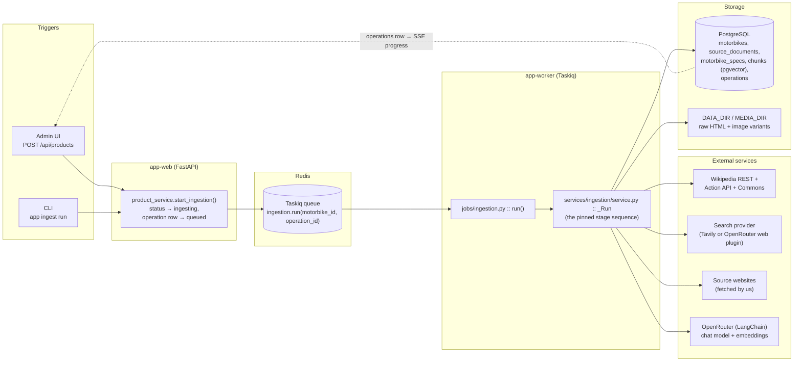
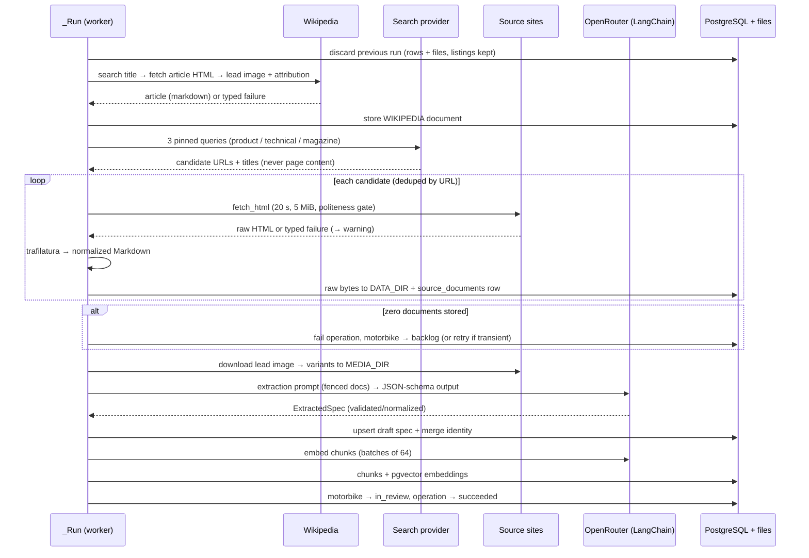
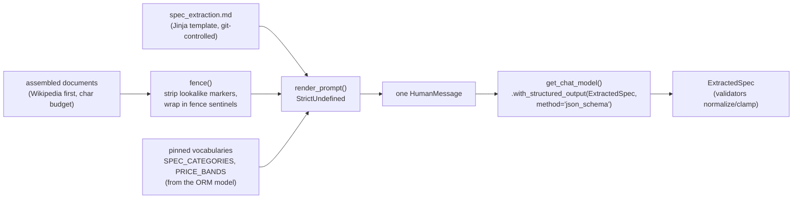

# The ingestion pipeline — architecture and step-by-step walkthrough

This document explains **how** ingestion works internally: the architecture,
the exact stage sequence, where the LLM prompts come from, and how external
services and the LLM are invoked. For the admin-facing *usage* view (UI flow,
CLI commands, configuration), see [ingestion.md](ingestion.md).

**Scope:** ingestion is everything that turns one catalogue name (e.g.
"Suzuki GSR600") into review material — stored source documents, a draft
specification, an image, and an embedded knowledge base — ending with the
entry in `in_review`, waiting for an admin's approve/reject decision.

## 1. Big picture

Ingestion is an **asynchronous background job**. The API (or CLI) only creates
state and enqueues; a separate worker process executes the pipeline and
reports progress through the database, which the admin UI watches over SSE.



Key modules:

| Layer | Module | Responsibility |
|---|---|---|
| Enqueue | [product_service.py](../backend/app/services/product_service.py) (`start_ingestion`) | Status transition, `operations` row, enqueue — in that pinned order |
| Job shell | [jobs/ingestion.py](../backend/app/jobs/ingestion.py) | Worker session, failure/retry policy — nothing else |
| Orchestration | [services/ingestion/service.py](../backend/app/services/ingestion/service.py) | The stage sequence, milestones, warning policy, fresh-run semantics |
| Adapters | [wikipedia.py](../backend/app/services/ingestion/wikipedia.py), [search.py](../backend/app/services/ingestion/search.py), [fetch.py](../backend/app/services/ingestion/fetch.py), [extract.py](../backend/app/services/ingestion/extract.py), [storage.py](../backend/app/services/ingestion/storage.py) | One external concern each; typed failures, never exceptions |
| LLM services | [spec_extraction_service.py](../backend/app/services/spec_extraction_service.py), [chunking.py](../backend/app/services/chunking.py), [embedding_service.py](../backend/app/services/embedding_service.py) | Decide what the model reads / what gets embedded, write results |
| LLM plumbing | [llm/models.py](../backend/app/llm/models.py), [llm/embeddings.py](../backend/app/llm/embeddings.py), [llm/extraction.py](../backend/app/llm/extraction.py), [llm/prompts.py](../backend/app/llm/prompts.py), [llm/fencing.py](../backend/app/llm/fencing.py) | LangChain-over-OpenRouter factories, prompt loading, untrusted-text fencing |

## 2. Trigger and job plumbing

`product_service.start_ingestion` does three things **in a pinned order** so a
worker can never pick up a job whose state is not yet visible:

1. Transition the motorbike to `ingesting` (commits, announces `product.updated`).
2. Create an `operations` row in `queued` (commits) — this row is the *only*
   state the enqueuing side and the worker share.
3. Enqueue `ingestion.run(motorbike_id, operation_id)` — **ids only**, no
   objects cross the process boundary.

The queue is Taskiq over Redis ([jobs/broker.py](../backend/app/jobs/broker.py))
with **no result backend**: PostgreSQL's `operations` table is the
application-visible job state, task return values are never read.

The task shell ([jobs/ingestion.py](../backend/app/jobs/ingestion.py)) owns the
failure policy:

- `TransientJobError` propagates → the broker's `SmartRetryMiddleware` retries
  (3 attempts, exponential backoff + jitter). Only this exception type is
  retried; anything else fails immediately.
- Any other exception → `abandon()`: motorbike back to `backlog`, operation
  marked `failed`, exception re-raised for the worker log.

## 3. The stage sequence

`_Run.execute()` in [service.py](../backend/app/services/ingestion/service.py)
walks a pinned sequence. The milestone wording and percentages are a
**contract** — the admin UI renders these messages verbatim:

| Progress | Message | Stage |
|---|---|---|
| 5 % | `Looking up Wikipedia` | Wikipedia article + lead image |
| 15 % | `Searching the web` | Search provider → fetch candidates |
| 20–60 % | `Fetching sources (n/m)` | Fetch + extract + store each candidate |
| 65 % | `Processing images` | Download image, write variants |
| 80 % | `Extracting specifications` | LLM structured extraction → draft spec |
| 90 % | `Generating embeddings` | Chunk + embed stored documents |
| 100 % | succeeded | Motorbike → `in_review` |



### 3.0 Fresh-run semantics

Before anything is fetched, everything a previous run left behind is deleted —
`source_documents` rows *and* their retained files, `motorbike_images` rows
*and* their variants — so a review screen never mixes two runs. The one
carve-out (D12): `listing` documents (used-price research provenance) survive
re-ingestion.

### 3.1 Wikipedia (5 %)

[wikipedia.py](../backend/app/services/ingestion/wikipedia.py) is four pinned
HTTP calls: REST search (limit 3, first usable hit; the **matched title** is
recorded as the disambiguation guard), article HTML through the shared fetch
layer, lead-image URL from the page summary, and a two-call attribution chain
(action API + Commons) for licence/author. The article goes through the same
extraction as every other source, so it obeys the same limits and Markdown
shape. Source type: `wikipedia` — the trust anchor downstream.

### 3.2 Web search (15 %)

[search.py](../backend/app/services/ingestion/search.py) is
**search-then-fetch**: a provider returns only `(url, title)` — its copy of
page content is deliberately dropped, because we fetch every page ourselves
for provenance and raw retention.

Three pinned query templates run per model, and **the template decides the
`source_type`** of its results — that is how the pipeline gets a labelled
source mix without an LLM classifying pages:

| Query | `source_type` |
|---|---|
| `"{name}" motorcycle official specifications` | `product` |
| `"{name}" technical data specifications` | `technical` |
| `"{name}" review test` | `magazine` |

Top 2 per template, deduped by URL, capped at `INGESTION_MAX_WEB_DOCUMENTS`.
Two providers implement the `SearchProvider` protocol, switched by
`SEARCH_PROVIDER` alone: `TavilySearchProvider` (raw `POST` to Tavily, no SDK)
and `OpenRouterSearchProvider` (the `web` plugin on OpenRouter's
chat-completions endpoint; only the machine-generated `url_citation`
annotations are read, the assistant's prose is discarded, and the
`utm_source` tag is stripped because the URL is provenance and the dedupe key).

Additionally, up to 3 links claimed in `motorbikes.suggestion` become fetch
candidates *ahead of* provider results (D6: an input hint — the stored claim
is never modified), and a claimed type code adds one extra query template.

### 3.3 Fetch + extract + store (20–60 %)

Every outbound request in the project goes through
[fetch.py](../backend/app/services/ingestion/fetch.py) `fetch_html`, so the
limits live in one place: 20 s timeout, 5 MiB ceiling **enforced while the
body streams in**, `text/html` only, redirects followed (provenance records
the post-redirect URL), an honest `User-Agent`, and a process-wide
`PolitenessGate` spacing requests to the same host ≥ 1 s apart (the search
API hosts included).

[extract.py](../backend/app/services/ingestion/extract.py) turns HTML into
normalized Markdown via **trafilatura**, with a heading rescue pass: when the
first extraction keeps no ATX headings (Wikipedia's REST HTML has no article
container), the body is re-extracted inside an `<article>` wrapper — headings
are what the chunker later splits on.

[storage.py](../backend/app/services/ingestion/storage.py) retains the raw
fetched bytes forever under `DATA_DIR/sources/{motorbike_id}/{document_id}.html`;
the row stores the DATA_DIR-relative path plus provenance (URL, title, type,
fetch time) and the extracted Markdown.

**Zero stored documents is the one deterministic failure** of a run: operation
`failed`, motorbike back to `backlog` — unless the emptiness was caused by
timeouts/network errors, in which case `TransientJobError` is raised and the
broker retries. Everything less than zero-documents is a **warning** appended
to the operation message; the run continues.

### 3.4 Image (65 %)

At most one image per run (the Wikipedia lead image), downloaded with the
shared client and gate, variants written under `MEDIA_DIR` (served read-only
at `/media`). A missing image is never a failure.

### 3.5 Spec extraction (80 %) — the first LLM call

Split across two modules:

- [spec_extraction_service.py](../backend/app/services/spec_extraction_service.py)
  decides **what the model reads**: Wikipedia first (trust order), each
  document head-truncated to 12 000 chars, total capped at
  `EXTRACTION_MAX_INPUT_CHARS` (character budget — no tokenizer dependency);
  `listing` documents never reach the prompt. It also **writes** the result:
  `upsert_draft_spec` is a full-object replace of the single `draft` row
  (idempotent by construction; the `verified` row is only ever written by
  approval), then the identity block (manufacturer, model name, years, type
  codes, variants) is merged into `motorbikes` under D2b rules — existing
  values win, type codes are unioned, so an admin's correction is permanent.
- [llm/extraction.py](../backend/app/llm/extraction.py) owns the schema, the
  prompt assembly and the chain (see §4 and §5).

A failed extraction is a warning, never the end of the run: the admin can fill
the spec form by hand, which is the correction mechanism anyway. The service
also records (never resolves) contradictions between the backlog suggestion
and what the sources actually printed (D13 pinned warning strings).

### 3.6 Chunk + embed (90 %)

`embedding_service.rebuild_motorbike` composes two halves:

- [chunking.py](../backend/app/services/chunking.py) — **structural chunking
  only**, two pinned LangChain splitters in sequence:
  `MarkdownHeaderTextSplitter` cuts at ATX headings (`#`–`####`) and keeps the
  heading trail as `heading_path` ("Suzuki GSR600 > Design"), then
  `RecursiveCharacterTextSplitter` cuts oversized sections at
  `CHUNK_SIZE_CHARS`/`CHUNK_OVERLAP_CHARS`, preferring paragraph → line → word
  boundaries. Re-chunking is a delete-and-rewrite that resets the embedding
  columns to NULL: a rewritten text must never keep the old vector.
- [embedding_service.py](../backend/app/services/embedding_service.py) —
  embeds chunk texts in batches of 64, one commit per batch (a run that dies
  halfway keeps what it paid for), measures **every** vector before writing,
  and guards `EMBEDDING_DIMENSIONS` against the `vector(n)` column width — a
  mismatch raises `DimensionMismatchError` naming the required migration (the
  one failure here that is not reduced to a warning).

`listing` documents are excluded from chunking/embedding too (D12): dated
asking prices must not become timeless retrievable prose. An embedding failure
(missing key, gateway error after 3 in-service retries) is a warning; `app
embeddings rebuild` backfills later.

### 3.7 Completion

Motorbike → `in_review` **before** the operation closes as `succeeded` (so the
backlog row flips in the same moment its progress cell disappears). If sources
were missing, the final message keeps every warning:
`Completed with warnings: ...`.

## 4. Where prompts come from

Prompts are **version-controlled Markdown files**, not strings in code and not
database rows — reviewable and diffable:

```
backend/app/llm/prompts/
├── spec_extraction.md      ← the ingestion pipeline's prompt
├── advisor_system.md       ← chat advisor (not ingestion)
├── query_translation.md    ← retrieval (not ingestion)
└── ping.md                 ← smoke test
```

[llm/prompts.py](../backend/app/llm/prompts.py) renders them with **Jinja2 +
`StrictUndefined`**: a variable the template uses but the caller did not pass
raises instead of silently producing a prompt with a hole in it. Autoescaping
is off on purpose (Markdown to a model, not HTML to a browser).

For spec extraction, `render_extraction_prompt` in
[llm/extraction.py](../backend/app/llm/extraction.py) renders
`spec_extraction.md` with the model name, the pinned category/price-band
vocabularies, and the assembled documents. The prompt pins the extraction
rules: only-from-the-documents, unknown-is-null, documents ordered by trust,
units per field, deltas-only variants, never derive displacement from the name.

**Untrusted-text fencing:** every fetched document is wrapped between
`<<<UNTRUSTED-DOCUMENT-START>>>` / `<<<UNTRUSTED-DOCUMENT-END>>>` markers,
defined once in [llm/fencing.py](../backend/app/llm/fencing.py). `fence()`
strips anything resembling the markers from the text first, so a document
cannot close its own block and continue as instructions; the prompt explicitly
declares everything inside the fences to be quoted data, never instructions —
the prompt-injection defence for content fetched from the public web.



## 5. How the LLM and external services are invoked

**Ingestion contains no agentic tool-calling.** The pipeline is deterministic
orchestration: `_Run` calls the adapters in a pinned order from Python code —
the model never decides which "tool" runs next. (Model-driven tool calling
lives in the *chat advisor* path, `backend/app/llm/agents/`, which is a
separate pipeline.) Within ingestion, "invocation" means three things:

### 5.1 External services — plain code adapters

Wikipedia, the search provider and every source website are called with raw
`httpx` through the shared fetch layer (timeout, size ceiling, politeness
gate, honest User-Agent). Which search provider runs is a **configuration**
decision (`SEARCH_PROVIDER`), resolved by `get_search_provider()` against the
`SearchProvider` protocol — a new provider is a new class plus a config value,
never a change to the job. Even `OpenRouterSearchProvider` deliberately uses
raw httpx rather than the LangChain factory: the model there is only the
vehicle carrying the web plugin, not a reasoning step whose prose is read.

### 5.2 The chat model — LangChain over OpenRouter, structured output

[llm/models.py](../backend/app/llm/models.py) `get_chat_model()` is the single
place a chat model is built: `ChatOpenRouter` (LangChain), OpenRouter as the
only gateway — never the OpenAI API directly — with the configured
`CHAT_MODEL`, a 60 s timeout, 2 retries, and Langfuse observability callbacks
attached centrally when configured.

The extraction chain is exactly:

```python
get_chat_model(model).with_structured_output(ExtractedSpec, method="json_schema")
```

so the model is **constrained by a JSON schema**, not asked nicely for JSON.
The schema *is* the frozen spec column set: `ExtractedSpec` mirrors
`motorbike_spec.SPEC_FIELDS` 1:1 (plus identity fields stored elsewhere), the
pinned vocabularies are enums built from the ORM model, and every field is
optional because "the documents do not say" is the normal answer.

Trust in the model is deliberately low — validation happens on the way in:
every field carries a `BeforeValidator` that normalizes plausible model output
(foreign units converted via a pinned unit table, decimal commas, text
booleans, thousands separators) and **clamps anything implausible to `None`**
instead of erroring — a null field the admin fills in is cheaper than a wrong
field they must notice first. Two provider concessions live on the schema
seam (all fields listed in `required` with null unions; variant `specs`
travel as `{key, value}` pair arrays and are reshaped back), documented in
`ExtractedSpec.model_json_schema`.

### 5.3 Embeddings — the OpenAI-compatible wrapper pointed at OpenRouter

[llm/embeddings.py](../backend/app/llm/embeddings.py) `get_embeddings()` uses
LangChain's `OpenAIEmbeddings` as a *protocol* client with `base_url` set to
OpenRouter's OpenAI-shaped `/api/v1/embeddings` route (langchain-openrouter
ships no embeddings class). `check_embedding_ctx_length=False` is mandatory
(otherwise LangChain sends token arrays that OpenAI-compatible gateways
reject), and no `dimensions` parameter is sent — the pinned model's native
size matches the column by migration, not by request-time parameter.

## 6. Error-handling policy (one sentence per rule)

- **Adapters return typed failures, never raise** (`FetchFailure`,
  `WikipediaFailure`, `ExtractFailure`, `ExtractionFailure`,
  `EmbeddingFailure`) — only the orchestrator knows whether a missing source
  is a warning or the end of the run.
- **A partial failure is a warning**, appended to the operation message; the
  run continues and the final message keeps the full list.
- **Zero usable documents is the one deterministic failure** → operation
  `failed`, motorbike → `backlog`.
- **Transient network causes raise `TransientJobError`** → broker-level retry
  of the whole run (which is safe because a run is a fresh run).
- **`DimensionMismatchError` escapes loudly** — a deployment mistake naming
  its migration, never reduced to warning text.
- **The two LLM stages can never cost the run its documents** — review
  proceeds without a spec (admin fills the form) or without vectors
  (`app embeddings rebuild` backfills).

## 7. Where everything ends up

| Artifact | Location |
|---|---|
| Raw fetched payloads | `DATA_DIR/sources/{motorbike_id}/{document_id}.html` (host: `backend/var/data`) |
| Normalized Markdown + provenance | `source_documents` (Postgres) |
| Draft specification | `motorbike_specs` (`status = draft`; approval promotes to `verified`) |
| Identity block | `motorbikes` (manufacturer FK, model name, years, type codes, variants) |
| Image variants | `MEDIA_DIR` (host: `backend/var/media`), served at `/media/...` |
| Chunks + embeddings | `chunks` (full-text + pgvector columns) |
| Job state / progress | `operations` (streamed to the UI over SSE) |
